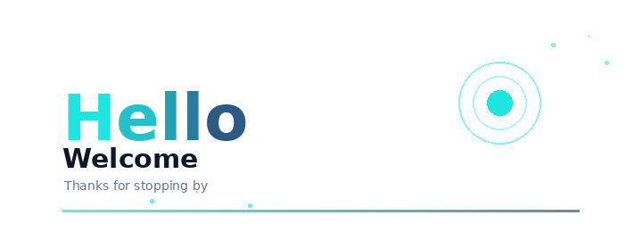

# Hello · 你好

A friendly space to say hi, welcome every follower, and invite collaboration.

一个友好的小空间，向每一位关注者问好，并欢迎一起合作。

**[中文](#中文) · [English](#english)**

---

## 中文

你好呀，欢迎来到这里！

感谢每一位关注我的朋友，是你们让开源社区变得温暖而有意义。无论你来自哪里、做什么技术，都欢迎在这里留下你的足迹。

### 欢迎合作

- 欢迎一起参与 MicroPython / 嵌入式 / 硬件小项目
- 欢迎 Issue、PR、想法交流
- 不限水平，新手老手都欢迎

### 联系方式

- GitHub: [@TOTOLZQ](https://github.com/TOTOLZQ)
- 项目: [li-learn-micropython](https://github.com/TOTOLZQ/li-learn-micropython)

<a href="#hello--你好">↑ 返回顶部</a>

---

## English

Hi there, welcome!

Thank you to everyone who follows me — you make the open source community warm and meaningful. Wherever you are from and whatever tech you do, feel free to leave your footprint here.

### Open to Collaboration

- Happy to collaborate on MicroPython / embedded / hardware projects
- Issues, PRs, and idea exchanges are all welcome
- All skill levels welcome, beginners and pros alike

### Contact

- GitHub: [@TOTOLZQ](https://github.com/TOTOLZQ)
- Project: [li-learn-micropython](https://github.com/TOTOLZQ/li-learn-micropython)

<a href="#hello--你好">↑ Back to top</a>

